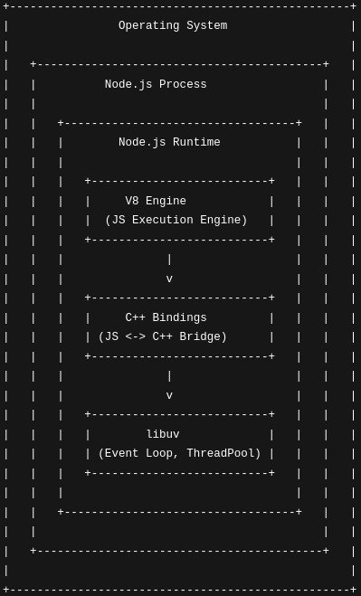

# Node.js Architecture & Execution Process (Complete Note)

Node.js যখন একটা file (যেমন `script.js`) execute করে, তখন এটা কেবল code line-by-line পড়ে না, বরং এটা বেশ কিছু complex step পার হয়ে কাজ করে। নিচে আমি step-by-step পুরো process-টা বিস্তারিতভাবে বুঝিয়ে বলছি:

---

## 📌 Table of Contents (Quick Navigation)

- [১. Initialization &amp; Environment Setup](#১-initialization--environment-setup-পরিবেশ-তৈরি)
- [২. Module Wrapping &amp; V8 Compilation](#২-module-wrapping--v8-compilation-deep-dive)
- [৩. V8 Engine: Compilation &amp; Execution](#৩-v8-engine-compilation--execution-the-translator)
- [৪. Wrapper Function Call → Execution Context](#৪-wrapper-function-call--execution-context-created)
- [৫. Event Loop &amp; Thread Pool](#৫-event-loop--thread-pool-asynchronous-magic)
- [৬. Thread Pool (Libuv)](#৬-thread-pool-libuv)
- [৭. Final Execution &amp; Exit](#৭-final-execution--exit-কাজ-শেষ)
- [৮. Chronological Summary](#-chronological-summary-best-for-revision)
- [৯. Optimization Logic (TurboFan)](#-৩৬-optimization-logic)
- [১০. V8 Isolate Explained](#-v8-isolate-তৈরি-হয়--এটা-আসলে-কী-বোঝায়-note-version)
- [১১. Execution Context (Deep Dive)](#-1-what-is-execution-context)

---

## ১. Initialization & Environment Setup (পরিবেশ তৈরি)

তুমি যখন কমান্ড লাইনে `node script.js` লিখো, তখন Node.js তার ইঞ্জিন (V8) কে অ্যাক্টিভেট করে এবং environment set up করে।

### ১.১ "Environment set up" মানে কী?

Environment set up করা মানে Node.js তোমার code চালানোর জন্য একটা **"Infrastructure"** বা **"Platform"** তৈরি করে। শুধু JavaScript code থাকলেই হয় না, সেটা চালানোর জন্য কিছু জিনিস (JavaScript চালানোর জন্য **V8 + Event Loop + libuv + OS APIs + Node APIs + Module system + Memory management**) দরকার হয় যা Node.js provide করে।

#### ১.১.১ V8 Engine initialize করা

তুমি যখন `node script.js` চালাও, তখন **Node.js process start হয়** এবং এর সাথে embed করা **V8 engine initialize হয়**। Embed kora keno bole nicer diagram dekhlei clear hoye jabe

<p align="center">
  
</p>
Node.js নতুন করে V8 “create” করে না—V8 আগে থেকেই Node.js executable-এর সাথে embed করা থাকে।

V8 initialize হওয়ার সময়:

* একটি **V8 isolate** তৈরি হয় (ref)
* একটি **V8 Context** তৈরি হয়,যেটার ভেতরে একটি **global object** থাকে এবং built-in bindings attach করা হয়
* JavaScript code execute করার জন্য প্রয়োজনীয় internal structures set up হয়

এরপর JavaScript code-এর execution lifecycle শুরু হয়,
যা V8 engine দ্বারা ECMAScript specification অনুযায়ী implement করা হয়—

JavaScript source code parse করা, bytecode generate করা, এবং প্রয়োজনে optimized machine code তৈরি করে code execute করা।

##### V8 ইঞ্জিন কী?

V8 হলো Google-এর তৈরি একটি  **open-source JavaScript engine** , যেটা  **host application দ্বারা embed করা হয়** ।

Node.js এবং Chrome—দুটোই V8 embed করে, কিন্তু  **নিজেদের আলাদা environment ও APIs যোগ করে** ।

👉 JavaScript language একই থাকে,

👉 কিন্তু host environment আলাদা হওয়ায় browser আর server-এ ক্ষমতা আলাদা হয়।

##### ✅ V8 কী কী করে (Responsibilities)

V8 **শুধুমাত্র JavaScript language execution layer** হ্যান্ডেল করে:

* JavaScript source code **parse** করে
* Source code থেকে **AST তৈরি করে**
* AST → **Bytecode** generate করে (Ignition interpreter)
* Frequently executed (hot) code হলে **Optimized Machine Code** generate করে (TurboFan JIT compiler)
* JavaScript **execute** করে
* **Memory management & Garbage Collection** পরিচালনা করে
* **Microtask Queue** পরিচালনা করে
  (কিন্তু কখন execute হবে তা host environment নির্ধারণ করে)

  (যেমন: `Promise.then`, `queueMicrotask`)

👉 এগুলো সবই **language-level responsibility**

##### ❌ V8 কী কী করে না (NOT V8’s Job)

নিচের জিনিসগুলো  **V8 কখনোই করে না** :

* ❌ **Event Loop**
* ❌ **Timers** (`setTimeout`, `setInterval`)
* ❌ **Async I/O**
* ❌ **File System access**
* ❌ **Networking (HTTP, TCP, UDP)**

👉 কারণ এগুলো **JavaScript language feature না**

👉 এগুলো **runtime / OS-level কাজ**

##### ✅ uporer jei kaaj v8 korena এই কাজগুলো কে করে?

###### 🟢 **Node.js runtime**

* JavaScript-এ API expose করে, যেগুলোর implementation C++ bindings দ্বারা করা
  * `setTimeout`, `setInterval`
  * `fs`, `http`, `net`, `crypto`
* JavaScript ↔ C++ bindings দেয়
* V8 আর libuv-কে connect করে

###### 🔵 **libuv**

* **Event Loop** চালায়
* **Async I/O** handle করে
* **Thread Pool** manage করে
* OS system calls ব্যবহার করে file ও network operations পরিচালনা করে

#### ১.১.২ Global Objects Initialize করা

Browser-এ যেমন `window` বা `document` থাকে, Node.js-এ সেগুলো থাকে না। Environment setup-এর সময় Node.js কিছু **global object** তৈরি করে:

| Global Object  | কাজ                                                                                                            |
| -------------- | ----------------------------------------------------------------------------------------------------------------- |
| `global`     | Main global object (Browser-এর `window`-এর মতো)                                                          |
| `process`    | তোমার program-টা কতো memory খাচ্ছে বা কোন version-এ চলছে সেটা এইখানে থাকে |
| `Buffer`     | Binary data handle করার জন্য                                                                              |
| `console`    | Console output দেখানোর জন্য                                                                            |
| `setTimeout` | Timer functions                                                                                                   |

##### 🧠 Global-এ কী থাকে — ৩টা ক্যাটাগরি

###### ১.১.২.১ **Node-specific Globals**

এগুলো Node.js নিজে যোগ করে:

```
global
├── process
│   ├── argv               → CLI arguments
│   ├── env                → Environment variables
│   ├── pid                → Process ID
│   ├── ppid               → Parent Process ID
│   ├── platform           → OS name
│   ├── arch               → CPU architecture
│   ├── version            → Node version
│   ├── versions
│   │   ├── node
│   │   ├── v8
│   │   └── uv
│   ├── cwd()
│   ├── chdir()
│   ├── exit()
│   ├── uptime()
│   ├── memoryUsage()
│   └── nextTick()
│
├── Buffer
│   ├── from()
│   ├── alloc()
│   ├── allocUnsafe()
│   ├── isBuffer()
│   └── byteLength()
│
├── console
│   ├── log()
│   ├── error()
│   ├── warn()
│   ├── info()
│   ├── table()
│   ├── time()
│   └── timeEnd()
│
├── setTimeout()
│   └── Timeout
│       ├── ref()
│       ├── unref()
│       └── hasRef()
│
├── setInterval()
│   └── Timeout
│       ├── ref()
│       ├── unref()
│       └── hasRef()
│
├── setImmediate()
│   └── Immediate
│       ├── ref()
│       ├── unref()
│       └── hasRef()
│
├── clearTimeout()
├── clearInterval()
└── clearImmediate()

```

✔️ এগুলো Node-এর runtime feature

✔️ require ছাড়াই পাওয়া যায়

###### ১.১.২.২ **JavaScript (ECMAScript) built-in globals**

এগুলো Node বানায় না — **JavaScript ভাষা নিজেই দেয়**

Node শুধু এগুলো রাখে।

```
global
├── Object
├── Array
├── Function
├── String
├── Number
├── Boolean
├── Math
├── Date
├── JSON
├── Promise
├── Error
├── Map
├── Set
├── WeakMap
└── WeakSet
```

👉 এগুলো  **Browser-এও থাকে** , Node-এও থাকে

👉 কারণ এগুলো **language feature**

###### ১.১.২.৩ **Some utility globals**

ছোট কিন্তু দরকারি:

```
global
├── setImmediate
├── queueMicrotask
├── atob / btoa (newer Node)
└── structuredClone
```

(Version অনুযায়ী কিছু বাড়ে/কমে)

##### ❌ Global-এ কী থাকে না (IMPORTANT)

এইগুলা **global object-এ থাকে না** 👇

###### ❌ Core modules

```
fs
http
net
crypto
path
os
```

❌ কারণ:

```js
fs.readFile()      // ❌
require('fs')      // ✅
```

###### ❌ Internal runtime systems

```
Event Loop
Thread Pool
libuv
```

❌ এগুলো JS object না

❌ এগুলো runtime machinery

###### ❌ Module wrapper things

```
require
module
exports
__dirname
__filename
```

❌ এগুলো global না

✔️ এগুলো **per-file wrapper-এ আসে**

##### 🧩 সবকিছু একসাথে — FINAL MAP

```
global
├── JS built-ins (Object, Array, Promise, ...)
├── Node globals (process, Buffer, console, timers)
├── Utilities (queueMicrotask, structuredClone)
└── ❌ NOT included
   ├── fs, http, crypto (require needed)
   ├── Event Loop, Thread Pool (internal)
   └── require, __dirname (module wrapper)
```

##### 🔑 Golden Rule (এইটা মনে রাখো)

```
Language feature → global
Runtime helper → global
Heavy system API → require
Internal machinery → invisible
```

##### 🟢 একদম পরিষ্কার উত্তর (Bangla, interview-ready)

> **না, global object-এ শুধু process বা timer না।
>
> JavaScript-এর সব built-in object + Node-এর কিছু runtime API global-এ থাকে।
>
> কিন্তু core modules (fs, http) আর internal systems (event loop, thread pool) global-এ থাকে না।**

#### ১.১.৩ Libuv (Event Loop) Start করা

এটা environment setup-এর **সবচেয়ে গুরুত্বপূর্ণ** part। Libuv event loop initialize হয় এবং
JavaScript execution শুরু হলে activeভাবে কাজ শুরু করে, যা Node.js-কে "Asynchronous" হতে সাহায্য করে।

##### Libuv কী?

Libuv হলো একটি **C library** যেটা Node.js-এর অ্যাসিনক্রোনাস কাজগুলো হ্যান্ডেল করে:

- **I/O Operations:** ফাইল রিড/রাইট
- **Networking:** HTTP requests, TCP/UDP connections
- **Thread Pool:** ভারী কাজগুলোর জন্য আলাদা থ্রেড (সাধারণত ৪টি thread)
- **Event Loop:** অ্যাসিনক্রোনাস কাজের সমন্বয়

#### ১.১.৪ C++ Bindings Connect করা

JavaScript দিয়ে সরাসরি তোমার computer-এর **Hard Drive** বা **Network card**-এ access করা যায় না। Environment setup-এর সময় Node.js JavaScript code-কে তার **C++ library-র (C++ Bindings)** সাথে connect করে দেয়, যাতে JavaScript দিয়ে তুমি file system বা internet access করতে পারো।

##### সহজ কথায়:

> Environment setup মানে একটা **"কারখানা"** তৈরি করা। V8 হচ্ছে engine, Libuv হচ্ছে কাজের নিয়ম, আর Module Wrapper হচ্ছে কাঁচামাল processing-এর জায়গা।

## ২. Module Wrapping & V8 Compilation (Deep Dive)

Node.js যখন কোনো ফাইল লোড করে, তখন পর্দার আড়ালে নিচের ধাপগুলো একে একে ঘটে:

#### ২.১ স্ট্রিং ম্যানিপুলেশন (Wrapping)

Node.js প্রথমে তোমার ফাইলের সমস্ত কোডকে একটি **স্ট্রিং (String)** হিসেবে পড়ে। তারপর সেই স্ট্রিংয়ের শুরুতে এবং শেষে কিছু বাড়তি কোড জোড়া দিয়ে একটি **Function Expression** তৈরি করে।

ধরা যাক তোমার `app.js` ফাইলে শুধু এই লাইনটি আছে:

**JavaScript**

```
console.log("Hello Node");
```

Node.js এটাকে এভাবে স্ট্রিং হিসেবে সাজায়:

**JavaScript**

```javascript
// শুরুতে যোগ করে:
"(function (exports, require, module, __filename, __dirname) { " 
// তোমার আসল কোড:
"console.log('Hello Node');"
// শেষে যোগ করে:
"\n});"
```

### এই wrapper-এর সুবিধা:

| প্যারামিটার | টাইপ | কাজ                                           |
| ---------------------- | -------- | ------------------------------------------------ |
| `exports`            | Object   | মডিউল থেকে কিছু export করতে     |
| `require`            | Function | অন্য মডিউল import করতে              |
| `module`             | Object   | বর্তমান মডিউলের রেফারেন্স |
| `__filename`         | String   | বর্তমান ফাইলের পুরো path        |
| `__dirname`          | String   | বর্তমান ফাইলের directory path       |

## ৩. V8 Engine: Compilation & Execution (The Translator)

V8 ইঞ্জিন JavaScript-কে সরাসরি এক্সিকিউট করে না। এটা কয়েকটি ধাপে কাজ করে:

### Computer-এর Processor কী বুঝতে পারে?

> **সহজ কথায়:** Computer-এর processor JavaScript বুঝে না, সে বুঝে শুধু **0 আর 1 (Binary)**।

#### JavaScript vs Machine Code

তুমি যখন লিখো `console.log("Hello")`, এটা হচ্ছে **High-level language**। এটা মানুষ বুঝতে পারে, কিন্তু computer-এর hardware (CPU) এর কাছে এটা শুধু একটা text file।

**Machine Code** হচ্ছে processor-এর নিজস্ব ভাষা (Instruction Set)। প্রতিটি processor-এর (Intel, AMD, বা Apple M1) নির্দিষ্ট কিছু instruction থাকে (যেমন: "Memory থেকে data আনো", "দুইটি number যোগ করো")।

#### V8 Engine যেটা করে (Just-In-Time Compilation)

V8 engine তোমার JavaScript code-কে প্রথমে পড়ে এবং সেটাকে CPU-র জন্য **Binary Instructions**-এ convert করে দেয়।

ধরো তুমি লিখলে: `a + b`

V8 এটাকে CPU-র জন্য এমনভাবে translate করবে:

```markdown
MOV (Memory থেকে a-এর value register-এ নাও)
MOV (Memory থেকে b-এর value register-এ নাও)
ADD (দুইটি register যোগ করো)
```

#### Processor কী "Execute" করে?

Processor execute করে  **V8-generated machine code** ,
JavaScript না

Processor V8-generated machine code theke  binary instructions (010101...) গুলো পায় এবং তার ভেতরে থাকা লাখ লাখ tiny switches (transistors) on/off করার মাধ্যমে সেই কাজটা করে ফেলে।

### ধাপ ৩.১: Lexical Analysis (Tokenization)

প্রথমে কোডকে ছোট ছোট **tokens**-এ ভাঙে:

```js
// এই কোড:
const x = 5;

// এভাবে টোকেনে ভাঙে:
// ['const', 'x', '=', '5', ';']
```

### ধাপ ৩.২: V8 Parsing - দ্য ইনার ইঞ্জিনিয়ারিং (Deep Dive)

এটি V8 ইঞ্জিনের সবচেয়ে গুরুত্বপূর্ণ এবং ইন্টারেস্টিং পার্ট। এখানে ডিসিশন নেওয়া হয় কোডের কোন অংশ এখনই প্রসেস হবে আর কোনটা পরে।

#### ৩.২.১ মেমোরি ব্রিজ (C++ Heap থেকে V8 Heap)

Node.js যখন ফাইল রিড করে, সে কিন্তু বোকার মতো পুরো কোড কপি করে V8-কে দেয় না। এটি একটি স্মার্ট পদ্ধতিতে কাজ করে:

1. **রিডিং:** Node.js (C++) প্রথমে ফাইলটি পড়ে তার নিজস্ব মেমোরিতে (C++ Heap) রাখে ।
2. **পয়েন্টার ট্রান্সফার (Pointer Transfer):** পুরো স্ট্রিং কপি করার বদলে, Node.js V8-কে শুধু মেমোরির **অ্যাড্রেস বা পয়েন্টার** ধরিয়ে দেয়। বলে, "এই ঠিকানায় কোড আছে, তুমি এখান থেকে পড়া শুরু করো।"
3. **API Call:** `v8::String::NewFromUtf8` - এই ধরনের API দিয়ে সে V8-কে নির্দেশ দেয়।

#### ৩.২.২ Eager vs Lazy Parsing (স্মার্ট মেমোরি ম্যানেজমেন্ট)

V8 ইঞ্জিন মেমোরি বাঁচানোর জন্য কোডকে দুই ভাগে ভাগ করে ফেলে:

**১. Eager Parsing (তৎক্ষণাৎ পার্সিং):**

* **কাকে করে?** মেইন বডির কোড, গ্লোবাল ভেরিয়েবল এবং যেসব ফাংশন এখনই রান করতে হবে।
* **কাজ:** এর জন্য সাথে সাথে **AST** এবং **Bytecode** তৈরি করে ফেলে।

**২. Lazy Parsing (অলস/দেরিতে পার্সিং):**

* **কাকে করে?** কোডের ভেতরে থাকা ফাংশন যা এখনি কল করা হয়নি (Uncalled Functions)।
* **কাজ:** V8 এই ফাংশনগুলোর ভেতরে বিন্দুমাত্র ঢোকে না। সে শুধু দেখে ফাংশনের নাম আর মেমোরিতে তার অবস্থান (Start/End Position)। একে বলে **Pre-parsing**।
* **সুবিধা:** পুরো কোডের AST না বানানোর ফলে মেমোরি এবং স্টার্ট-আপ টাইম প্রচুর বাঁচে।

#### ৩.২.৩ SharedFunctionInfo (SFI) - যেখানে "নোট" জমা থাকে

এখানেই অনেকের কনফিউশন হয়। প্রশ্ন হলো: **"Lazy Parsing-এর সময় ফাংশনের তথ্য কোথায় থাকে? AST-তে?"**

**উত্তর: না, AST-তে নয়।**

V8 যখন Lazy Parsing করে, তখন সে ফাংশনের জন্য মেমোরিতে (Heap-এ) **`SharedFunctionInfo` (SFI)** নামে একটি অবজেক্ট তৈরি করে।

| বৈশিষ্ট্য              | AST (Abstract Syntax Tree)                                                                             | SharedFunctionInfo (SFI)                                                            |
| :------------------------------ | :----------------------------------------------------------------------------------------------------- | :---------------------------------------------------------------------------------- |
| **কাজ**                | কোডের লজিক ও গ্রামার বোঝা                                                         | ফাংশনের 'আইডি কার্ড' বা মেটাডেটা রাখা                 |
| **কখন তৈরি হয়?** | **Eager:** সাথে সাথে`<br>`**Lazy:** যখন ফাংশন **কল** করা হয় | ফাংশন ডিক্লেয়ার করার সাথে সাথেই                          |
| **স্থায়িত্ব**  | বাইটকোড হয়ে গেলে মেমোরি থেকে মুছে যায় (Temporary)                       | পুরো প্রোগ্রাম চলাকালীন মেমোরিতে থাকে (Persistent) |
| **উপমা**              | রান্নার**চপিং বোর্ড** (কাজ শেষে ফাকা)                                 | লাইব্রেরির**ক্যাটালগ কার্ড** (সবসময় থাকে)     |

**ভিজ্যুয়াল প্রসেস:**

1. **Code:** `function myFunc() { ... }`
2. **Lazy Parse:** V8 দেখে "ওহ, এটা ফাংশন!" -> AST বানায় না -> **SFI** তৈরি করে (Start: line 10, End: line 20)।
3. **Function Call:** `myFunc()` কল হলো -> V8 SFI চেক করে কোড খুঁজে পায় -> সেই কোডটুকু নিয়ে **AST** বানায় -> **Bytecode** বানায় -> রান করে।

#### ৩.২.৪ AST Visualizer বনাম V8 Reality (সতর্কতা)

অনলাইন AST Visualizer-এ কোড দিলে পুরো গাছের ডালপালা (Full AST) দেখা যায়। কিন্তু বাস্তবে V8 রানটাইমে সেটা করে না।

* **Visualizer:** শেখার জন্য পুরো কোড "Eagerly" পার্স করে দেখায়।
* **V8 Reality:** পারফরমেন্সের জন্য অপ্রয়োজনীয় ফাংশন স্কিপ করে (Lazy Parsing)।

#### ৩.২.৫ পূর্ণাঙ্গ ফ্লো চার্ট (স্টেপ-বাই-স্টেপ)

| **স্টেপ**                        | **অ্যাকশন**                                         | **ইঞ্জিনের ভেতরে যা ঘটে**                                                                                             |
| ------------------------------------------- | ---------------------------------------------------------------- | --------------------------------------------------------------------------------------------------------------------------------------------- |
| **১. রিডিং**                    | Node.js ফাইল রিড করে পয়েন্টার V8-কে দেয় | Source Code (C++ Heap-এ থাকে, V8 Pointer পায়)                                                                                         |
| **২. গ্লোবাল পার্সিং** | `const a = 10`(Eager)                                          | AST তৈরি হয় ->**Ignition**একে **Bytecode** -এ রূপান্তর করে -> রান হয়।                                  |
| **৩. ফাংশন স্ক্যান**     | `function show()`(Lazy)                                        | *কোনো AST নেই। শুধু**SharedFunctionInfo (SFI)*তৈরি করে মেমোরিতে "বুকমার্ক" করে রাখে।               |
| **৪. ফাংশন কলিং**           | `show()`কল করা হলো                                     | V8 SFI চেক করে কোড খুঁজে পায় -> ফাংশনের ভেতরের কোডের জন্য**AST**তৈরি হয়।                  |
| **৫. ইন্টারপ্রিটিং**    | **Ignition**এর কাজ শুরু                           | Ignition ওই AST থেকে**Bytecode**জেনারেট করে এবং সাথে সাথে এক্সিকিউট করে।                        |
| **৬. অপ্টিমাইজেশন**      | **TurboFan**(JIT)                                          | ফাংশনটি বারবার কল হলে (Hot Function), TurboFan বাইটকোডকে সরাসরি**Machine Code**বানিয়ে ফেলে। |

### ধাপ ৩.৩: Ignition (Interpreter)

V8-এর **Ignition** interpreter AST থেকে **Bytecode** তৈরি করে। Bytecode হলো machine code-এর একটা intermediate form।

### ধাপ ৩.৪: TurboFan (JIT Compiler)

যে কোড বারবার run হয় (hot code), সেটাকে **TurboFan** compiler অপ্টিমাইজড **Machine Code**-এ কনভার্ট করে। এটাকে বলে **Just-In-Time (JIT) Compilation**।

Complete Flow:

```md
JavaScript Code
      ↓
   Tokenizer (Lexical Analysis)
      ↓
    Parser
      ↓
     AST (Abstract Syntax Tree)
      ↓
   Ignition → Bytecode
      ↓
   TurboFan → Optimized Machine Code (010101...)
      ↓
   Processor (CPU)
```

### Key Points:

- **Human Readable vs Machine Readable:** JavaScript হচ্ছে "Human Readable", কিন্তু CPU-র দরকার "Machine Readable" code।
- **The Translator:** V8 Engine এখানে একটা Interpreter এবং Compiler হিসেবে কাজ করে। সে code translate করে সরাসরি Processor-এর কাছে পাঠায়।
- **Result:** Processor সেই instructions গুলো execute করে আমাদের result দেখায় (যেমন screen-এ কিছু print করা বা file save করা)।

### ৩.৫ V8 Engine: Parsing (স্পষ্টীকরণ)

**Ignition (Interpreter)** এবং **TurboFan (JIT)** সম্পর্কে আরও একটি গুরুত্বপূর্ণ পয়েন্ট:

- V8 এখন আর সরাসরি Bytecode থেকে মেশিন কোড করে না।
- **Ignition** বাইটকোড তৈরি করে এবং সেটা সাথে সাথে রান করে (Interpreter)।
- যখন দেখা যায় একটা ফাংশন বারবার কল হচ্ছে (Hot Code), তখন **TurboFan** এসে সেটাকে অপ্টিমাইজড মেশিন কোডে রূপান্তর করে।

## ৪. Wrapper Function Call → Execution Context CREATED

Wrapper function call হওয়ার **আগে** Node.js runtime কিছু গুরুত্বপূর্ণ কাজ করে।

### 🔹 Call দেওয়ার আগেই Node.js runtime যা করে

Node.js runtime (C++ side):

1. বর্তমান ফাইলের জন্য একটি **Module object** তৈরি করে
2. `module.exports` তৈরি করে
3. `exports` কে `module.exports`-এর **reference** হিসেবে সেট করে
4. ওই ফাইলের জন্য একটি **local `require` function** তৈরি করে
5. ফাইলের **absolute path** থেকে `__filename` বানায়
6. ফাইলের **directory path** থেকে `__dirname` বানায়

📌 এই সব value **wrapper function call দেওয়ার আগেই প্রস্তুত থাকে**

### 🔹 এরপর Node.js runtime wrapper function call করে

সব value তৈরি হয়ে যাওয়ার পর Node.js runtime ভিতরে ভিতরে এভাবে call করে:

```js
wrapper(
  exports,        // reference to module.exports
  require,        // per-file local require function
  module,         // current Module object
  __filename,     // absolute file path
  __dirname       // directory path
);
```

⚠️ এই call JavaScript code থেকে হয় না

⚠️ এই call হয় **Node.js runtime (C++ → V8 boundary)** থেকে

### 🔥 এই exact moment-এই V8 কী করে?

V8 দেখে:

> “একটা function call এসেছে”

তখন V8:

- একটি **Function Execution Context** তৈরি করে
- সেটাকে **Call Stack-এ push** করে
- Wrapper function-এর parameters হিসেবে পাওয়া
  `exports`, `require`, `module`, `__filename`, `__dirname`
  — এই value গুলো **bind করে**

📌 **এই মুহূর্ত থেকেই actual execution শুরু হয়**

### 🧠 Important Clarification (Exam-safe)

- `exports`, `require`, `module`, `__filename`, `__dirname`
  - ❌ global না
  - ❌ compile-এর সময় বানানো না
  - ✅ execution-এর ঠিক আগ মুহূর্তে Node.js runtime বানায়
- **Execution Context**
  - ❌ Node.js বানায় না
  - ✅ **V8 বানায়**
  - ✅ function call detect করলেই

### 🟢 One-Line Final Version (Interview-Ready)

> Wrapper function call করার আগে Node.js runtime নিজে
>
> `exports`, `require`, `module`, `__filename`, `__dirname`-এর value তৈরি করে,
>
> তারপর wrapper function call করে,
>
> আর সেই call detect করেই V8 execution context তৈরি করে।

## ৫. Event Loop & Thread Pool (Asynchronous Magic)

Node.js হচ্ছে **Single Threaded**। মানে মেইন থ্রেডে একসাথে একটি মাত্র কাজ করতে পারে। কিন্তু যদি কোনো বড় কাজ থাকে (যেমন ফাইল রিড করা বা ডাটাবেস অ্যাক্সেস), তখন সেইটা **Libuv**-এর **Thread Pool**-এ পাঠিয়ে দেয়।

### Event Loop-এর ৬টি Phase:

```md
   ┌───────────────────────────┐
┌─>│         timers            │  ← setTimeout(), setInterval()
│  └─────────────┬─────────────┘
│  ┌─────────────┴─────────────┐
│  │     pending callbacks     │  ← I/O callbacks
│  └─────────────┬─────────────┘
│  ┌─────────────┴─────────────┐
│  │       idle, prepare       │  ← internal use
│  └─────────────┬─────────────┘
│  ┌─────────────┴─────────────┐
│  │           poll            │  ← incoming connections, data
│  └─────────────┬─────────────┘
│  ┌─────────────┴─────────────┐
│  │           check           │  ← setImmediate()
│  └─────────────┬─────────────┘
│  ┌─────────────┴─────────────┐
└──┤      close callbacks      │  ← socket.on('close')
   └───────────────────────────┘
```

### প্রতিটি Phase-এর বিস্তারিত:

| Phase                       | কাজ                                                              | উদাহরণ                   |
| --------------------------- | ------------------------------------------------------------------- | ------------------------------ |
| **Timers**            | `setTimeout()` ও `setInterval()` এর callbacks execute করে | `setTimeout(() => {}, 1000)` |
| **Pending Callbacks** | আগের iteration-এ complete হওয়া I/O callbacks             | TCP error callbacks            |
| **Idle/Prepare**      | Node.js-এর internal operations                                    | -                              |
| **Poll**              | নতুন I/O events fetch করে এবং callbacks execute করে    | File read complete             |
| **Check**             | `setImmediate()` callbacks execute করে                         | `setImmediate(() => {})`     |
| **Close Callbacks**   | Close events handle করে                                          | `socket.on('close')`         |

### Call Stack, Node APIs, Callback Queue:

| কম্পোনেন্ট                  | দায়িত্ব                                     | উদাহরণ                        |
| ------------------------------------- | ---------------------------------------------------- | ----------------------------------- |
| **Call Stack**                  | synchronous কোড execute করে (LIFO)             | `console.log()`, function calls   |
| **Node APIs**                   | async operations register করে                     | `setTimeout()`, `fs.readFile()` |
| **Callback Queue (Task Queue)** | async callbacks অপেক্ষা করে                | Timer callbacks                     |
| **Microtask Queue**             | Promises, process.nextTick()                         | `.then()`, `async/await`        |
| **Event Loop**                  | Stack খালি হলে Queue থেকে কাজ নেয় | -                                   |

### Priority Order:

```
1. Call Stack (সবার আগে)
2. Microtask Queue (process.nextTick > Promise)
3. Callback Queue (setTimeout, setInterval)
4. Check Queue (setImmediate)
```

## ৬. Thread Pool (Libuv)

Libuv-এর Thread Pool-এ by default **4টি worker thread** থাকে (UV_THREADPOOL_SIZE দিয়ে বাড়ানো যায়, max 1024)।

### Thread Pool যে কাজগুলো করে:

- File System operations (`fs.readFile()`)
- DNS lookups (`dns.lookup()`)
- Crypto operations (`crypto.pbkdf2()`)
- Zlib compression

```js
// Thread Pool সাইজ বাড়াতে:
process.env.UV_THREADPOOL_SIZE = 8;
```

## ৭. Final Execution & Exit (কাজ শেষ)

### Execution:

Processor code-এর result **output** হিসেবে দেখায় (যেমন: Console log করা বা response পাঠানো)।

### Exit:

যখন Call Stack খালি হয়ে যায় এবং কোনো pending অ্যাসিনক্রোনাস কাজ থাকে না, তখন Node.js প্রসেসটা বন্ধ হয়ে যায় (`process.exit()`)।

### Exit Conditions:

- Event Loop-এ কোনো pending work নেই
- কোনো active timers নেই
- কোনো pending I/O operations নেই

## 💡 Chronological Summary (Best for Revision):

```
1. Node Start ➔ V8 & Libuv চালু হয়
2. Wrapping ➔ Code-কে (function(...){ }) দিয়ে ঘেরা হয়
3. Parsing ➔ Code-কে AST-এ convert করা হয়
4. JIT Compiling ➔ AST থেকে Machine Code (0, 1) তৈরি হয়
5. Execution ➔ Call Stack-এ code execute হয়; heavy কাজ Thread Pool-এ যায়
6. Event Loop ➔ Background কাজের callback গুলোকে Stack-এ পাঠায়
7. Exit ➔ সব কাজ শেষ হলে process বন্ধ হয়
```

## বিস্তারিত উদাহরণ:

**JavaScript**

```js
console.log("1. শুরু"); // ১. Call Stack-এ যায়, সাথে সাথে প্রিন্ট হয়

setTimeout(() => {
  console.log("2. setTimeout"); // ৫. Timer phase-এ execute হয়
}, 0);

setImmediate(() => {
  console.log("3. setImmediate"); // ৬. Check phase-এ execute হয়
});

Promise.resolve().then(() => {
  console.log("4. Promise"); // ৩. Microtask Queue-তে যায়, Stack খালি হলেই execute
});

process.nextTick(() => {
  console.log("5. nextTick"); // ২. Microtask Queue-তে যায় (highest priority)
});

console.log("6. শেষ"); // ৪. Call Stack-এ যায়, সাথে সাথে প্রিন্ট হয়
```

**আউটপুট সিকুয়েন্স:**

```
1. শুরু
6. শেষ
5. nextTick
4. Promise
2. setTimeout
3. setImmediate
```

### কেন এই order?

1. **"1. শুরু"** - Synchronous, সরাসরি Stack-এ execute
2. **"6. শেষ"** - Synchronous, সরাসরি Stack-এ execute
3. **"5. nextTick"** - Microtask Queue (সর্বোচ্চ priority)
4. **"4. Promise"** - Microtask Queue (nextTick-এর পরে)
5. **"2. setTimeout"** - Timer phase
6. **"3. setImmediate"** - Check phase

## সারসংক্ষেপ (Quick Reference):

```
┌─────────────────────────────────────────────────────────┐
│                    Node.js Architecture                 │
├─────────────────────────────────────────────────────────┤
│  ┌─────────────────────────────────────────────────┐    │
│  │              Your JavaScript Code               │    │
│  └─────────────────────────────────────────────────┘    │
│                          ↓                              │
│  ┌─────────────────────────────────────────────────┐    │
│  │              Node.js Bindings                   │    │
│  │         (C++ code connecting JS to C)           │    │
│  └─────────────────────────────────────────────────┘    │
│                    ↓           ↓                        │
│  ┌──────────────────┐  ┌──────────────────────────┐     │
│  │    V8 Engine     │  │        Libuv             │     │
│  │  (JS → Machine)  │  │  (Async I/O, Thread Pool)│     │
│  └──────────────────┘  └──────────────────────────┘     │
│                          ↓                              │
│  ┌─────────────────────────────────────────────────┐    │
│  │              Operating System                   │    │
│  └─────────────────────────────────────────────────┘    │
└─────────────────────────────────────────────────────────┘
```

## 💡 Pro-Tip for Interview/Exam:

যদি কেউ জিজ্ঞেস করে, **"Node.js কেন single-threaded হয়েও fast?"**

**উত্তর:** কারণ Node.js heavy কাজগুলো নিজে করে না, সেগুলো **Libuv**-এর মাধ্যমে background-এ পাঠিয়ে দেয় এবং **Event Loop**-এর মাধ্যমে results গুলো manage করে।

### ৩.৬ Optimization Logic

#### ৩.৬.১ TurboFan সব ফাংশনের জন্য কেন নয়?

মেশিন কোড বানানো (Optimization) একটা ব্যয়বহুল বা দামী প্রসেস। এতে CPU এবং Memory অনেক খরচ হয়।

যদি তোমার অ্যাপে ১০০০টি ফাংশন থাকে এবং প্রতিটি ফাংশন মাত্র ১-২ বার কল হয়, তবে V8 যদি সবার জন্য মেশিন কোড বানাতে যায়, তাহলে তোমার অ্যাপ সুপার-ফাস্ট হওয়ার বদলে উল্টো স্লো হয়ে যাবে।

তাই V8 এর নীতি হলো: "যে ফাংশন বারবার খাটে, তাকেই আমি প্রমোশন দেব।"

---

#### ৩.৬.২ কখন TurboFan একশন নেয়? (The "Hot" Threshold)

ইঞ্জিন যখন বাইটকোড রান করে, সে তখন একটা Counter বা হিসাব রাখে যে কোন ফাংশন কতবার কল হচ্ছে।

- **Cold Function:** ১-৫ বার কল হয়েছে। (শুধু Ignition বাইটকোড চালাবে)।
- **Warm Function:** কয়েকশ বার কল হয়েছে। (ইঞ্জিন রেডি হতে থাকে)।
- **Hot Function:** যখন দেখে একই ফাংশন হাজার হাজার বার কল হচ্ছে (যেমন লুপের ভেতর বা রিকার্সন), তখন TurboFan একে সরাসরি Machine Code-এ রূপান্তর করে।

---

#### ৩.৬.৩ টাইপ স্পেশালাইজেশন (TurboFan-এর আসল ক্ষমতা)

ফাংশন বারবার কল হলেই শুধু হবে না, ইনপুট টাইপও এক হতে হবে। একে বলে **Speculative Optimization**।

```javascript
function add(a, b) {
  return a + b;
}

// ১০০০ বার কল হলো নম্বর দিয়ে
for(let i=0; i<1000; i++) add(i, i+1); 
```

এখানে TurboFan দেখবে `a` এবং `b` সবসময় **Number**। সে তখন এমন একটা মেশিন কোড বানাবে যা শুধু নম্বর যোগ করতে জানে। এটা রকেটের গতিতে চলবে।

##### সতর্কতা (De-optimization):

যদি ১০০১ তম বার তুমি `add("hello", "world")` কল করো, TurboFan অবাক হয়ে যাবে। সে দেখবে তার বানানো মেশিন কোড (যা শুধু নম্বরের জন্য) এখানে কাজ করবে না। তখন সে সাথে সাথে মেশিন কোড ফেলে দিয়ে আবার Ignition (Bytecode) এ ফেরত আসবে। এটাকে বলে **De-optimization**।

---

#### ৩.৬.৪ তোমার নোটের জন্য ফাইনাল ফ্লো-চার্ট (The Logic)

| **অবস্থা**               | **ইঞ্জিন পার্ট** | **আউটপুট**      | **গতি**      |
| ------------------------------------ | --------------------------------- | --------------------------- | --------------------- |
| **১ম বার কল**           | Ignition                          | Bytecode তৈরি ও রান | ভালো              |
| **বারবার কল (Hot)**    | TurboFan                          | Optimized Machine Code      | সুপার ফাস্ট |
| **টাইপ বদলে গেলে** | Bailing Out                       | Back to Bytecode            | স্লো              |

---

### সারসংক্ষেপ:

হ্যাঁ, ফাংশন বারবার ব্যবহারের জন্যই তৈরি, কিন্তু V8 বুদ্ধিমান। সে শুধু "বারবার ব্যবহৃত" এবং "একই ধরনের ডেটা (Stable Types)" নিয়ে কাজ করা ফাংশনগুলোকেই TurboFan দিয়ে মেশিন কোড বানায়।

## 🔹 “V8 isolate তৈরি হয়” — এটা আসলে কী বোঝায়? (NOTE VERSION) (Extra)

### 🟢 সহজ ভাষায় সংজ্ঞা

> **V8 isolate** মানে হলো JavaScript চালানোর জন্য V8 engine-এর ভেতরে তৈরি হওয়া একটি  **আলাদা memory space** , যেখানে একটি JavaScript program সম্পূর্ণ আলাদা ও নিরাপদভাবে চলে।

---

### 🟢 কেন isolate দরকার? (Real-life example)

ধরো তোমার  **laptop-এ একসাথে ২টা app চলছে** :

* 🧮 Calculator
* 📝 Notepad

❓ Calculator-এর memory-এর data

👉 Notepad কি দেখতে পারে?

**উত্তর: না ❌**

কারণ:

* Calculator-এর নিজের memory
* Notepad-এর নিজের memory

👉 Operating System এমনভাবে বানানো যে

**একটা app অন্য app-এর memory দেখতে পারে না**

(নাহলে security ভেঙে যাবে)

---

### 🟢 JavaScript / Node.js-এ একই ব্যাপার কীভাবে হয়?

ধরো তোমার laptop-এ একসাথে ২টা Node.js program চলছে:

<pre class="overflow-visible! px-0!" data-start="954" data-end="998"><div class="contain-inline-size rounded-2xl corner-superellipse/1.1 relative bg-token-sidebar-surface-primary"><div class="sticky top-[calc(var(--sticky-padding-top)+9*var(--spacing))]"><div class="absolute end-0 bottom-0 flex h-9 items-center pe-2"><div class="bg-token-bg-elevated-secondary text-token-text-secondary flex items-center gap-4 rounded-sm px-2 font-sans text-xs"></div></div></div><div class="overflow-y-auto p-4" dir="ltr"><code class="whitespace-pre! language-js"><span><span>// app1.js</span><span>
</span><span>let</span><span> password = </span><span>"12345"</span><span>;
</span></span></code></div></div></pre>

<pre class="overflow-visible! px-0!" data-start="1000" data-end="1044"><div class="contain-inline-size rounded-2xl corner-superellipse/1.1 relative bg-token-sidebar-surface-primary"><div class="sticky top-[calc(var(--sticky-padding-top)+9*var(--spacing))]"><div class="absolute end-0 bottom-0 flex h-9 items-center pe-2"><div class="bg-token-bg-elevated-secondary text-token-text-secondary flex items-center gap-4 rounded-sm px-2 font-sans text-xs"></div></div></div><div class="overflow-y-auto p-4" dir="ltr"><code class="whitespace-pre! language-js"><span><span>// app2.js</span><span>
</span><span>let</span><span> password = </span><span>"abcde"</span><span>;
</span></span></code></div></div></pre>

❓ `app2.js` কি `app1.js`-এর `password` দেখতে পারবে?

👉 **না ❌**

---

### 🟢 কেন দেখতে পারে না? (এইখানেই V8 isolate)

কারণ:

* `app1.js` চলছে **একটা V8 isolate-এর ভেতরে**
* `app2.js` চলছে **আরেকটা V8 isolate-এর ভেতরে**

<pre class="overflow-visible! px-0!" data-start="1267" data-end="1442"><div class="contain-inline-size rounded-2xl corner-superellipse/1.1 relative bg-token-sidebar-surface-primary"><div class="sticky top-[calc(var(--sticky-padding-top)+9*var(--spacing))]"><div class="absolute end-0 bottom-0 flex h-9 items-center pe-2"><div class="bg-token-bg-elevated-secondary text-token-text-secondary flex items-center gap-4 rounded-sm px-2 font-sans text-xs"></div></div></div><div class="overflow-y-auto p-4" dir="ltr"><code class="whitespace-pre!"><span><span>Laptop
 ├── Node.js App </span><span>1</span><span>
 │     └── V8 Isolate </span><span>1</span><span>
 │           └── </span><span>password</span><span> = "12345"
 │
 └── Node.js App </span><span>2</span><span>
       └── V8 Isolate </span><span>2</span><span>
             └── </span><span>password</span><span> = "abcde"
</span></span></code></div></div></pre>

👉 **এক isolate অন্য isolate-এর memory দেখতে পারে না**

একদম Calculator vs Notepad-এর মতো।

---

### 🟢 তাহলে “V8 isolate তৈরি হয়” মানে কী?

যখন **Node.js** চালু হয়:

1. Node.js process start হয়
2. ভিতরের **V8** initialize হয়
3. V8 প্রথমে একটি **isolate তৈরি করে**
4. তারপর JavaScript code ওই isolate-এর ভেতরে execute হয়

👉 **V8 isolate ছাড়া JavaScript চালানোই হয় না**

---

### 🟢 এক লাইনের golden sentence (EXAM / INTERVIEW SAFE)

> **V8 isolate** হলো JavaScript program-এর জন্য তৈরি করা একটি আলাদা ও নিরাপদ memory container, যেখানে program-এর সব variables, objects ও data অন্য program থেকে সম্পূর্ণ আলাদা থাকে।

---

### 🧠 মনে রাখার shortcut

<pre class="overflow-visible! px-0!" data-start="2510" data-end="2594"><div class="contain-inline-size rounded-2xl corner-superellipse/1.1 relative bg-token-sidebar-surface-primary"><div class="sticky top-[calc(var(--sticky-padding-top)+9*var(--spacing))]"><div class="absolute end-0 bottom-0 flex h-9 items-center pe-2"><div class="bg-token-bg-elevated-secondary text-token-text-secondary flex items-center gap-4 rounded-sm px-2 font-sans text-xs"></div></div></div><div class="overflow-y-auto p-4" dir="ltr"><code class="whitespace-pre!"><span><span>OS app </span><span>isolation</span><span>  ≈  V8 isolate
Calculator vs Notepad  ≈  app1</span><span>.js</span><span> vs app2</span><span>.js</span></span></code></div></div></pre>

---

## ৮. Execution Context & Scope (Deep Dive)

---

## 1. What is Execution Context?

**Execution Context** = যে environment-এ JS code execute হয়

এটা manage করে:

- variables
- functions
- scope info
- `this` binding
- সেই execution-এর জন্য memory

---

## 2. Execution Context Structure

```
ExecutionContext
├─ LexicalEnvironment (let/const/params + outer)
├─ VariableEnvironment (var/functions)
└─ thisBinding
```

---

## 3. LexicalEnvironment

**যা store করে:**

- `let`
- `const`
- block-scoped variables
- parameters
- catch variables

**Structure:**

```javascript
LexicalEnvironment {
  EnvironmentRecord,    // variables এখানে stored
  outer                 // parent reference (scope chain)
}
```

**Note:** Parameters `let`-এর মতো behave করে, `var`-এর মতো না — তাই এরা এখানে থাকে!

---

## 4. EnvironmentRecord (Actual Memory Table)

**Real storage (hashmap/dictionary):**

```javascript
{
  a: 10,
  b: 20,
  sayHi: function(){}
}
```

প্রতিটা binding internally store করে:

```javascript
{
  value,
  initialized,  // TDZ check
  mutable,
  deletable
}
```

---

## 5. VariableEnvironment

**যা store করে:**

- `var`
- function declarations

**Structure:**

```javascript
VariableEnvironment {
  EnvironmentRecord,
  outer
}
```

**Note:** স্পেসিফিকেশন অনুযায়ী `VariableEnvironment`-এরও একটি `outer` থাকে, কিন্তু জাভাস্ক্রিপ্ট ইঞ্জিন ভ্যারিয়েবল খোঁজার সময় (Lookup Algorithm) সবসময় **`LexicalEnvironment`** চেইন ব্যবহার করে

---

## 6. thisBinding

**যা store করে:** `this`-এর value

**Call type-এর উপর depend করে:**

| Call Type      | `this` Value                |
| -------------- | ----------------------------- |
| Browser global | `window`                    |
| Node global    | `global`/`module.exports` |
| Method call    | object                        |
| Constructor    | new instance                  |
| Strict mode    | `undefined`                 |
| Arrow function | inherited                     |

---

## 7. Creation Phase vs Execution Phase

প্রতিটা context **two passes**-এ run হয়:

### Creation Phase (Memory Setup)

- Memory allocate করে
- Declarations register করে
- `this` set করে
- Scope chain build করে

| Type                 | Stored as            |
| -------------------- | -------------------- |
| var                  | undefined            |
| let/const            | uninitialized (TDZ)  |
| function declaration | full function object |
| parameters           | argument values      |
| this                 | binding created      |

**এখানে create হয় না:** arrow functions, function expressions, `new Function()`

### Execution Phase

- Values assign করে
- Line-by-line code run করে
- Expressions evaluate করে
- Functions call করে

---

## 8. Scope Chain

Lexical Environments-এর Linked list

```
current → parent → parent → global → null
```

**Lookup algorithm:**

```javascript
let env = current
while (env != null) {
  if (found) return value
  env = env.outer
}
throw ReferenceError
```

---

## 9. Part 1 — Parameters

### Example

```javascript
function sum(a, b) {
  console.log(a, b)
}
sum(10, 20)
```

### What Beginners Think

অনেকে মনে করে: `parameters = special thing` ❌

### Reality

Parameters হলো শুধুই **JS দ্বারা automatically create হওয়া local variables**

Engine এদের এভাবে treat করে:

```javascript
let a = 10
let b = 20
```

### Creation Phase Step-by-Step

যখন `sum(10, 20)` call হয়:

**Step 1 — New Execution Context created**

```javascript

Function_ExecutionContext (sum)
├── LexicalEnvironment {
|  	EnvironmentRecord,
| 	Outer -> parent
|   }
|
├── VariableEnvironment{
|	EnvironmentRecord,
|	Outer -> parent
|   }
|
└── thisBinding

```

**Step 2 — Parameters stored**

Engine insert করে:

```javascript
a → 10
b → 20
```

Result:

```javascript

Function_ExecutionContext (sum)
├── LexicalEnvironment {
|  	EnvironmentRecord {
|		  a: 10, 
|		  b: 20  
|	},
|
| 	Outer -> parent
|   }
|
├── VariableEnvironment{
|   	EnvironmentRecord,
|
| 	Outer -> parent
|   }
|
└── thisBinding
```

### Important Behavior

যেহেতু এরা `let`-এর মতো behave করে:

- ✅ block scoped
- ✅ var-এর মতো hoisted না
- ✅ outer scope থেকে separate
- ✅ outer variables-কে shadow করে

### Example: Parameter Shadowing

```javascript
let a = 100

function test(a) {
  console.log(a)
}

test(5)  // Output: 5
```

কেন? কারণ parameter `a` outer `a`-কে shadow করে

Same as:

```javascript
function test() {
  let a = 5
}
```

### Rule

Parameters **LexicalEnvironment**-এ থাকে, VariableEnvironment-এ না

কারণ: এরা `let`-এর মতো block scoped.

**IMPORTANT**:

* ২. **Parameters এর ক্ষেত্রে:** ফাংশন কল করার সাথে সাথে (Execution Context তৈরির সময় (creation phase e)) ইঞ্জিন প্যারামিটারগুলোকে **Arguments** দিয়ে ভরে ফেলে। যদি আর্গুমেন্ট না থাকে, তবে ইঞ্জিন **শুরুতেই** সেটিকে `undefined` দিয়ে দেয়।

### আপনার জন্য একটি "Proof" উদাহরণ (যা দিয়ে ভুলটি বুঝবেন):

**JavaScript**

```javascript
// ১. লেট (let) এর ক্ষেত্রে:
function testLet() {
  try {
    console.log(x); // এখানে 'x' মেমোরিতে আছে, কিন্তু empty (TDZ)
  } catch (e) {
    console.log("let Error:", e.message); 
  }
  let x; // কোড এই লাইনে আসলে x = undefined হয়।
}

// ২. প্যারামিটারের ক্ষেত্রে:
function testParam(p) {
  // এখানে 'p' অলরেডি undefined হয়ে বসে আছে। 
  // কোনো TDZ পিরিয়ড নেই কারণ ফাংশন বডিতে ঢোকার আগেই ইঞ্জিন p = undefined সেট করেছে।
  console.log("Param Value:", p); 
}

testLet();
testParam(); // আর্গুমেন্ট না দিলেও p সরাসরি undefined, কোনো এরর নেই।
```

## 10. Part 2 — Catch Variables

### Example

```javascript
try {
  throw "error"
} catch (err) {
  console.log(err)
}
```

### Reality

JS **catch block-এর জন্য একটা special temporary LexicalEnvironment create করে**

### Step-by-Step Internally

যখন catch run হয়, engine create করে:

```javascript
LexicalEnvironment_catch {
  EnvironmentRecord {
    err: "error"
  }
  outer → parent
}
```

### Why Special Environment?

Catch variable অবশ্যই:

- ✅ শুধুমাত্র catch-এর ভেতরে exist করবে
- ❌ বাইরে leak হবে না

### Example: Scope Isolation

```javascript
try {
  throw "error"
} catch (err) {
  console.log(err)  // ✅ "error"
}

console.log(err)    // ❌ ReferenceError
```

কারণ: block-এর পরে `err` destroy হয়ে যায়

### How Engine Ensures This

এভাবে:

- শুধুমাত্র catch-এর জন্য একটা NEW LexicalEnvironment create করে
- Block end হওয়ার পর সেটা delete করে

### Visual

```
Global LexicalEnv
  ↓
Catch LexicalEnv (temporary)
  err → "error"
```

Block-এর পরে:

```
Catch LexicalEnv destroyed
```

### Why NOT VariableEnvironment?

কারণ:

VariableEnvironment হলো: `var` + function declarations-এর জন্য

এবং: `var` হলো function-scoped

কিন্তু: parameters + catch অবশ্যই block-scoped হতে হবে

তাই: **LexicalEnvironment**

---

## 11. Final Comparison

| Thing         | Stored in   | Why                      |
| ------------- | ----------- | ------------------------ |
| let/const     | LexicalEnv  | block scoped             |
| parameters    | LexicalEnv  | block scoped             |
| catch vars    | LexicalEnv  | block scoped + temporary |
| var           | VariableEnv | function scoped          |
| function decl | VariableEnv | hoisted                  |

---

## 12. Super Simple Mental Model

এভাবে চিন্তা করো:

```
LexicalEnvironment  = modern variables
VariableEnvironment = old var stuff
```

তাই: parameters & catch modern-এর মতো behave করে → Lexical-এ যায়

---

## 13. Function Storage

Declaring-এর সময়:

```javascript
function sum(a, b) { return a + b }
```

- **EnvironmentRecord:** `sum` → reference (address)
- **Heap:** function object store করে (`[[Code]]`, `[[ParamNames]]`, `[[Scope]]`)
- শুধুমাত্র reference scope-এ stored; body heap-এ থাকে
- Parameters শুধুমাত্র function call হলে create হয়

---

## 14. Stack vs Heap (Closures!)

### Stack (Temporary)

- Execution contexts store করে (call order)
- Function return করলে destroy হয়

### Heap (Persistent)

- Variables, objects, functions, lexical environments store করে
- Automatically destroy হয় না

---

## 15. Closures

**Definition:** Closure = function + তার outer lexical environment-এর reference

### Example

```javascript
function outer() {
  let count = 0
  return function inner() {
    console.log(count)
  }
}
const fn = outer()
fn()  // prints 0
```

`inner` `outer`-এর environment-এর reference রাখে, তাই `count` alive থাকে।

---

## 16. Garbage Collection & Closures

- Memory delete হয় **শুধুমাত্র যখন কোনো references থাকে না** (reachability rule)
- Closures environments-কে alive রাখে যতক্ষণ তাদের reference থাকে

### Example

```javascript
function outer() {
  let x = 10
  return function inner() { 
    console.log(x) 
  }
}
const fn = outer()   // x alive থাকে
fn = null            // এখন x garbage collected হতে পারে
```

---

## 17. Example: Full Walkthrough

```javascript
var a = 10
let b = 20

function outer(x) {
  var c = 30
  let d = 40

  function inner() {
    let e = 50
    console.log(a, b, c, d, e, x)
  }

  inner()
}

outer(99)
```

### Global Context

- Lexical: b → `<uninitialized>`
- Variable: a → undefined, outer → function
- this: window/global

### Outer() Context

- Lexical: x → 99, d → `<uninitialized>`
- Variable: c → undefined, inner → function

### Inner() Context

- Lexical: e → `<uninitialized>`
- Variable: {}

### Variable Lookup Table

| Variable | Found in    | Value |
| -------- | ----------- | ----- |
| e        | inner       | 50    |
| x        | outer       | 99    |
| d        | outer       | 40    |
| c        | outer(var)  | 30    |
| b        | global      | 20    |
| a        | global(var) | 10    |

**Output:** `10 20 30 40 50 99`

---

## 18. Final Mental Model

```
ExecutionContext
├─ LexicalEnvironment (let/const/params + outer)
├─ VariableEnvironment (var/functions)
└─ this

Stack → execution only
Heap → variables এখানে থাকে
Closures → heap-কে alive রাখে
```

---

## 19. Golden Rules

- ✅ প্রতিটা function call = new Execution Context
- ✅ Execution-এর আগে Creation হয়
- ✅ Scope chain LexicalEnvironment.outer use করে
- ✅ let/const-এর TDZ আছে
- ✅ parameters let-এর মতো behave করে
- ✅ functions heap-এ stored
- ✅ stack frames return-এর পর die করে
- ✅ closures lexical environments-কে alive রাখে
- ✅ memory delete হয় শুধুমাত্র যখন কোনো references নেই

---

## 20. One-Line Summary

JavaScript variables heap-based lexical environments-এ store করে, scope chain-এর মাধ্যমে resolve করে, এবং closures সেই environments-কে alive রাখে যতক্ষণ না কোনো references থাকে।

---

## V8 Global Context কী? (engine-level)

**V8 Global Context** হলো  **V8-এর ভিতরের জিনিস** ।

এটা তৈরি হয়:

* যখন V8 **initialize** হয়
* JavaScript code চলার **আগেই**

এটার কাজ:

* `global` object বানানো
* Built-in জিনিস attach করা

  (`Object`, `Array`, `Promise`, `console`, ইত্যাদি)

👉 এটা হলো **“JS world বানানোর কাঠামো”**
